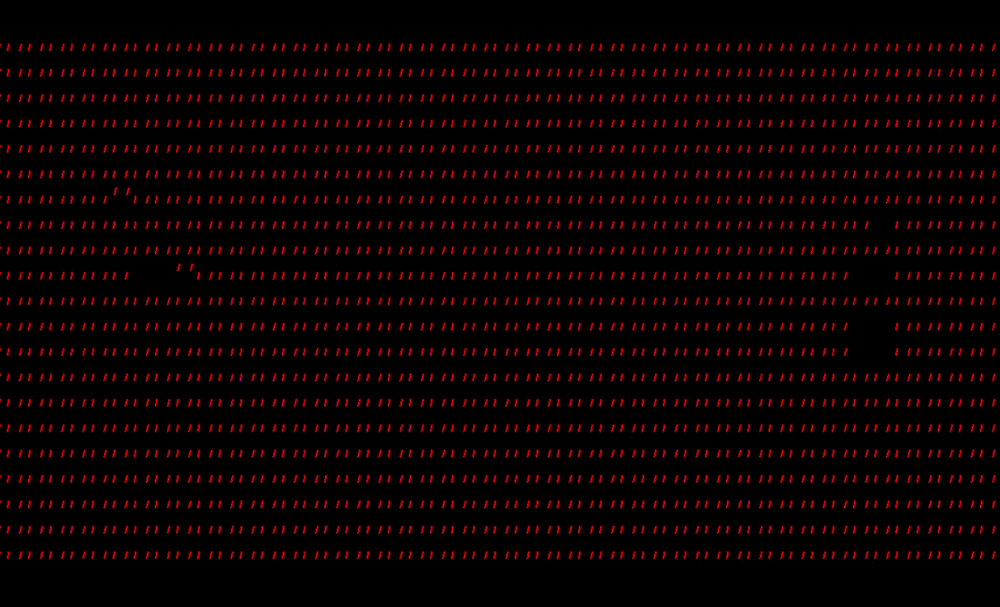

# Seven Segment Sign

    

## Welcome to the Seven Segment Sign! (SSS)


## Getting Started
Here are some helpful links to get you up and running!
- [API Docs](https://sss.readthedocs.io/en/latest/API/Display/)
- [Install on Linux/Mac](https://sss.readthedocs.io/en/latest/Installation/Install%20SSS%20on%20Mac%20or%20Linux/)
- [Install on Windows](https://sss.readthedocs.io/en/latest/Installation/Install%20SSS%20on%20Windows/)
- [Create your first demo](https://sss.readthedocs.io/en/latest/Tutorials/Creating%20a%20demo/)

## Common Commands
Although thorough information on how to [get started](https://sss.readthedocs.io/en/latest/Overview/Get%20started/) is in the docs, here are some quick commands you can run in order to get rolling **once you have everything installed**:

- Run the PyGame Simulator for the SSS
  ```bash
  python3 main.py simulator
  ```
- Run a specific demo in the simulator
  ```bash
  python3 main.py demo <demo_name> -s
  ```
- Start the SSS in kiosk mode
  ```bash
  python3 main.py kiosk
  ```
- To view log output of varying degrees, use the `-v` option (the more `v`'s the more `v`erbose the output becomes

For any other help or a list of comprehensive commands, run
```bash
python3 main.py --help
```

## Reporting an Issue
We love feedback! As the SSS codespace expands and acquires new features, we realize that some bugs will fall through the cracks. Please feel free to open a new issue if you notice any bugs in the code, mistakes or missing information in the documentation, or if you want a new feature to be added to the project.

You can go to the **Issues** tab to create a new issue. Please be mindful to choose the correct template for the right type of question. Apart from the currently open issues from before this writing, any **issue that does not conform to the template may become stale or be closed without warning.**

## Submitting a PR
If you are feeling creative and you would like to contribute a demo but you are outside of our organization, you are more than welcome to submit a pull request and we will look it over! 

In order for a pull request to be merged, we have the following three policies:
1. Your code must have adequate, meaningful comments. Don't feel like you have to explain every statement, but also don't write comments like `# This a loop that goes over all the values`.
2. Your PR will need approval from **at least 2 org members**. Users who respond to these the most are @apal6981, @christopolise, and @philipbl
3. Your code **MUST** be formatted with `black`. This is as simple as adding the [Black Formatter](https://marketplace.visualstudio.com/items?itemName=ms-python.black-formatter) to VS/OSS Code or running `python3 -m black <your py files>`
