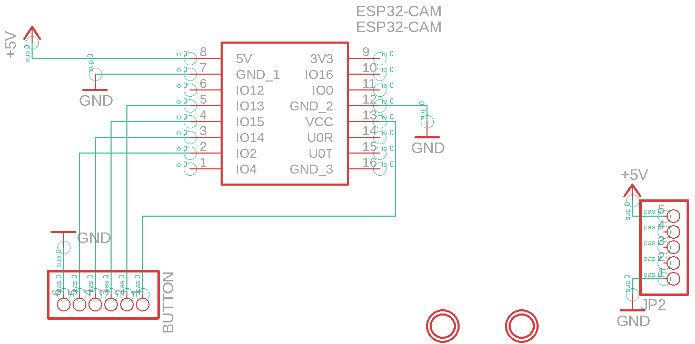
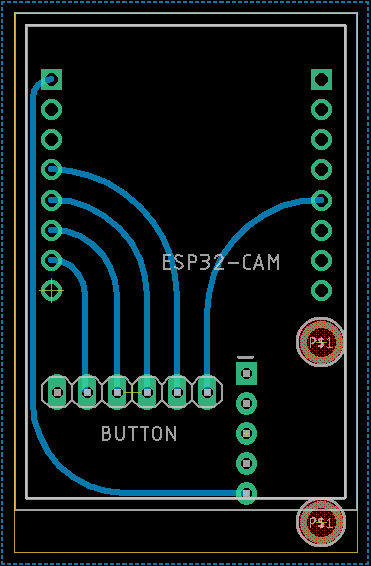

The camera module exists thanks to the creative camera demo. While any camera which streams to an IP address will work with the demo, we have provided an inexpensive option that can integrate nicely with the SSS. This module is centered around the ESP-CAM kit and it's firmware. An optional set of pins was included in the design to allow for a peripheral to connect to the camera if necessary. All of these files are available in the [hw/camera]() directory of the project.

## Camera PCB Blueprints

### Backpack Schematic

### Backpack PCB

## Camera Enclosure

### Lid

<!-- Import maps polyfill -->
<!-- Remove this when import maps will be widely supported -->

### Case

