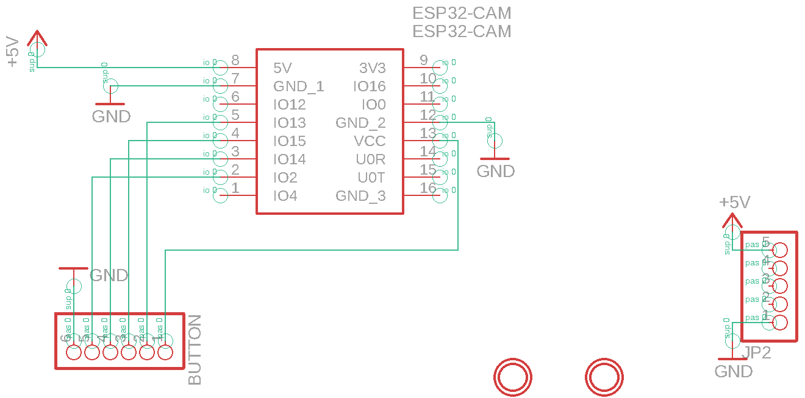
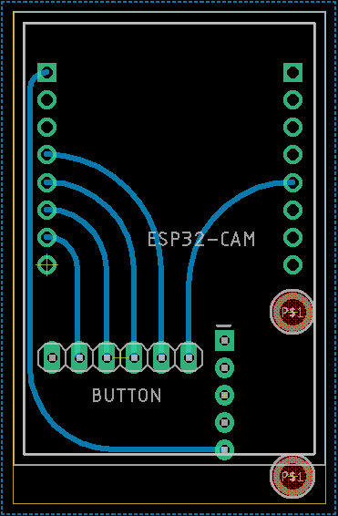

The purpose of a camera module exists thanks mainly thanks to the creative camera demo by [Bryson Schiel](https://www.linkedin.com/in/bryson-s-82926aa6/). While any camera which streams to an IP address will work with the demo, we have provided an inexpensive option which integrates nicely with the SSS. This module is centered around the ESP-CAM kit and it's firmware. All of these files are available in the [hw/camera](https://github.com/NET-BYU/sss/tree/docs/hw/camera) directory of the project. All of these files were designed and provided by [Carter Pollan](https://github.com/virginia2244).

## Camera PCB Blueprints

### Backpack Schematic
The ESP-CAM normally comes with its own backpack which provides power. An optional set of pins was included in the design to allow for a peripheral to connect to the camera if necessary. The backpack that we have provides power and also a breakout to connect devices to some of the GPIO pins.

### Backpack PCB
This PCB is single-sided and has no vias which means that it can be etched on the most simple of mills. It also features some groovy, curved traces for a nice aesthetic. [Check this video out](https://youtu.be/euJgtLcWWyo) to see why melty boards are superior.

## Camera Enclosure

For those who aren't a big fan of have a jumbled mess of wires and PCBs, a sleek two piece case has also been designed to encapsulate and mount the camera module.  

### Lid

<!-- Import maps polyfill -->
<!-- Remove this when import maps will be widely supported -->

### Case

