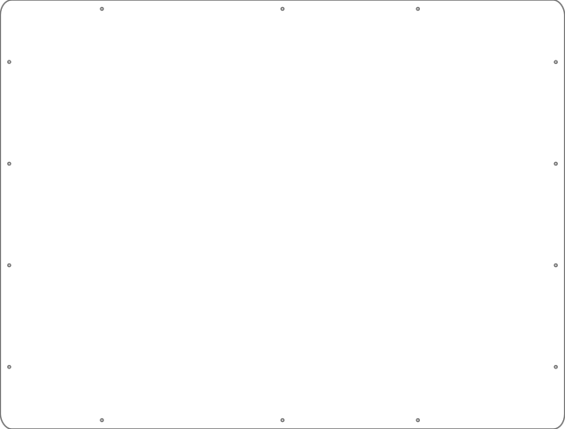
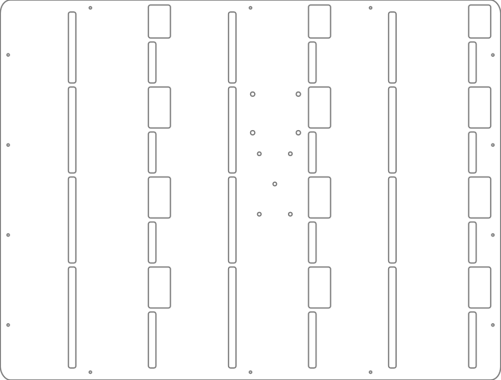

## Enclosure

The enclosure for the physical SSS is made out of two an acryllic (**NOT POLYCARBONATE**) plexiglass fastened together by 18 x M3 screws in a 20mm standoff. The SVG files in [hw/enclosure](https://github.com/NET-BYU/sss/tree/docs/hw/enclosure) can be loaded onto a plasma/laser cutter to create the pieces.

### Front Piece
The shape and the mounting holes are seen in this figure below:

### Back Piece
The shape and the mounting holes are also seen on this piece. The upper group of 4 holes in the center allows for the mounting of a Raspberry Pi. The lower five are mounting holes for the [power and breakout board](Power%20Board.md). The slender slots allow for [resistors soldered to the `clk` and `din` pins](Panel.md) to poke out while the larger openings allow for the commnication and power cable to plug into the SSS's panels.

## Feet

The feet for the SSS are 3D printed pieces that allow for each panel (both front and back) to insert and stand inside it. The more feet are put on the bottom of the enclosure, the more stable it will be.

