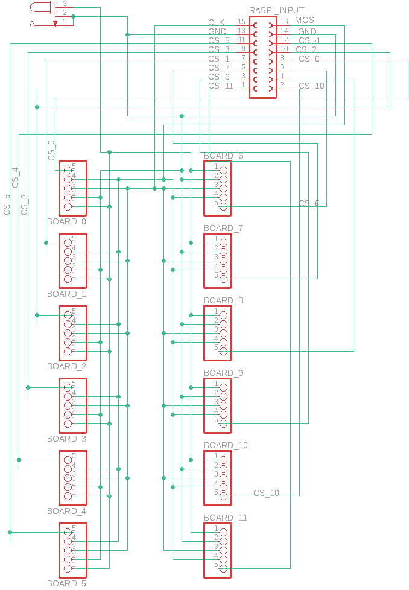
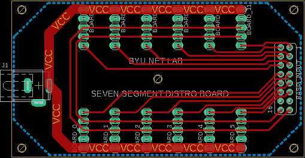

## Power Board PCB Blueprints

The power board is a breakout board which takes the SPI protocol wires from the [Raspberry Pi IO](Raspberry%20Pi%20IO.md) and passes them on to the each of the individual [panels](Panel.md). Along with the SPI protocol wires, this board will also power the SSS panels.

### Power Board Schematics

The power board receives all of the Raspberry Pi IO on its 8 x 2 Raspberry Pi headers and reroutes them to the BOARD_n headers. These BOARD_n pins will connect to the SV1 pins on the panels. There is also a barrel jack on this board where a DC adapter that outputs 5V and 4A will supply power to all of the ICs and LED seven segment digits on the panels of the SSS.

### Power Board PCB

### Power Board
