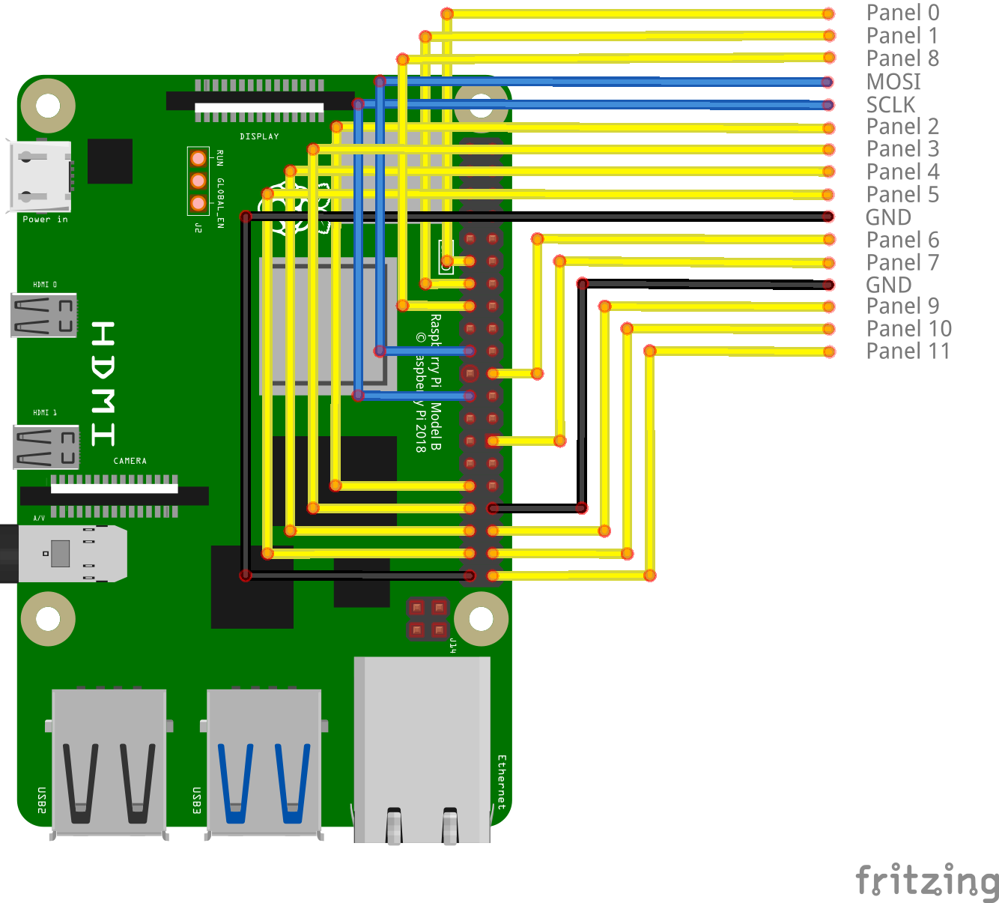

At the center of the SSS is the Raspberry Pi, a compact, inexpensive computer that has a very accessible hardware interface. The SSS takes advantage of this interface and connects to all of its [panels](Panel.md) through the Pi's GPIO. Checkout this [link](https://pinout.xyz) to get an interactive guide to the GPIO.

## SPI Interface
The communication protocol the SSS uses to draw to all of the panels is the Serial Peripheral Interface (or SPI for short). We won't go into the [exact details](https://www.circuitbasics.com/basics-of-the-spi-communication-protocol/) of how this protocol works, but suffice it to say there are several connections necessary to make this work:

- **MOSI (Master Out Slave In)**: The actual binary instruction which tell the panel what to draw to the screen.
- **CS (Chip Select)**: This wire has to be on (or high) in order to receive and apply instructions from MOSI. There is one of these for each panel in our project.
- **SCLK (Clock Signal)**: This wire has an oscillating high-low timing signal that helps all the CS wires and MOSI stay in sync with each other.

## Device Tree Overlay
As you start exploring the Raspberry Pi GPIO its SPI busses (or groups of pins meant to act as a SPI device) you'll notice they only have 1 or 2 CS pins max. This means that by default, a Raspberry Pi can talk to two separate devices (or in our case, panels) at a time. This becomes a problem considering that the SSS has 12 panels!

We can overcome this problem by reassigning some of the GPIO pins on the Pi to be CS pins for our SPI bus. To do this, we will need to create a device tree overlay, or a special configuration file which reminds the Raspberry Pi's operating system on startup to make these changes to the pin definitions.

### Creating the Device Tree Source file

```c
/dts-v1/;
/plugin/;

/ {
	compatible = "brcm,bcm2835", "brcm,bcm2836", "brcm,bcm2708", "brcm,bcm2709", "brcm,bcm2710";

	fragment@0 {
		target = <&spi0>;
		frag0: __overlay__ {
			#address-cells = <1>;
			#size-cells = <0>;
			pinctrl-0 = <&spi0_pins &spi0_cs_pins>;
			status = "okay";
			// cs-gpios = <0>, <0>, <0>, <0>, <0>, <0>, <0>, <0>, <0>, <0>, <&gpio 0 1>, <&gpio 5 1>, <&gpio 6 1>, <&gpio 13 1>, <&gpio 19 1>, <&gpio 26 1>, <&gpio 1 1>, <&gpio 12 1>, <&gpio 16 1>, <&gpio 20 1>;
			cs-gpios = <0>, <0>, <&gpio 6 1>, <&gpio 13 1>, <&gpio 19 1>, <&gpio 26 1>, <&gpio 25 1>, <&gpio 1 1>, <&gpio 12 1>, <&gpio 16 1>, <&gpio 20 1>, <&gpio 21 1>, <&gpio 17 1>, <&gpio 27 1>, <&gpio 22 1>;
			// cs-gpios = <0>, <0>, <&gpio 0 1>, <&gpio 5 1>;

			spidev@2{
				compatible = "spidev";
				reg = <2>;	/* CE2 */
				#address-cells = <1>;
				#size-cells = <0>;
				spi-max-frequency = <500000>;
			};

			spidev@3{
				compatible = "spidev";
				reg = <3>;	/* CE3 */
				#address-cells = <1>;
				#size-cells = <0>;
				spi-max-frequency = <500000>;
			};

			
			spidev@4{
				compatible = "spidev";
				reg = <4>;	/* CE4 */
				#address-cells = <1>;
				#size-cells = <0>;
				spi-max-frequency = <500000>;
			};

			spidev@5{
				compatible = "spidev";
				reg = <5>;	/* CE5 */
				#address-cells = <1>;
				#size-cells = <0>;
				spi-max-frequency = <500000>;
			};

			spidev@6{
				compatible = "spidev";
				reg = <6>;	/* CE6 */
				#address-cells = <1>;
				#size-cells = <0>;
				spi-max-frequency = <500000>;
			};


			spidev@7{
				compatible = "spidev";
				reg = <7>;	/* CE7 */
				#address-cells = <1>;
				#size-cells = <0>;
				spi-max-frequency = <500000>;
			};


			spidev@8{
				compatible = "spidev";
				reg = <8>;	/* CE8 */
				#address-cells = <1>;
				#size-cells = <0>;
				spi-max-frequency = <500000>;
			};

			spidev@9{
				compatible = "spidev";
				reg = <9>;	/* CE9 */
				#address-cells = <1>;
				#size-cells = <0>;
				spi-max-frequency = <500000>;
			};

			spidev@10{
				compatible = "spidev";
				reg = <10>;	/* CE10 */
				#address-cells = <1>;
				#size-cells = <0>;
				spi-max-frequency = <500000>;
			};

			spidev@11{
				compatible = "spidev";
				reg = <11>;	/* CE11 */
				#address-cells = <1>;
				#size-cells = <0>;
				spi-max-frequency = <500000>;
			};

			spidev@12{
				compatible = "spidev";
				reg = <12>;	/* CE11 */
				#address-cells = <1>;
				#size-cells = <0>;
				spi-max-frequency = <500000>;
			};

			spidev@13{
				compatible = "spidev";
				reg = <13>;	/* CE11 */
				#address-cells = <1>;
				#size-cells = <0>;
				spi-max-frequency = <500000>;
			};

			spidev@14{
				compatible = "spidev";
				reg = <14>;	/* CE11 */
				#address-cells = <1>;
				#size-cells = <0>;
				spi-max-frequency = <500000>;
			};

		};
	};

	fragment@1 {
		target = <&gpio>;
		__overlay__ {
			spi0_cs_pins: spi0_cs_pins {
				// brcm,pins = <0 5 6 13 19 26 1 12 16 20>;
				brcm,pins = <6 13 19 26 25 1 12 16 20 21 17 27 22>;
				brcm,function = <1>; /* out */
			};
		};
	};

	__overrides__ {
		cs2_pin = <&frag0>,"cs-gpios:12", <&spi0_cs_pins>,"brcm,pins:0";
		cs3_pin = <&frag0>,"cs-gpios:24", <&spi0_cs_pins>,"brcm,pins:4";
		cs4_pin = <&frag0>,"cs-gpios:36", <&spi0_cs_pins>,"brcm,pins:8";
		cs5_pin = <&frag0>,"cs-gpios:48", <&spi0_cs_pins>,"brcm,pins:12";
		cs6_pin = <&frag0>,"cs-gpios:60", <&spi0_cs_pins>,"brcm,pins:16";
		cs7_pin = <&frag0>,"cs-gpios:72", <&spi0_cs_pins>,"brcm,pins:20";
		cs8_pin = <&frag0>,"cs-gpios:84", <&spi0_cs_pins>,"brcm,pins:24";
		cs9_pin = <&frag0>,"cs-gpios:96", <&spi0_cs_pins>,"brcm,pins:28";
		cs10_pin = <&frag0>,"cs-gpios:108", <&spi0_cs_pins>,"brcm,pins:32";
		cs11_pin = <&frag0>,"cs-gpios:120", <&spi0_cs_pins>,"brcm,pins:36";
		cs12_pin = <&frag0>,"cs-gpios:132", <&spi0_cs_pins>,"brcm,pins:40";
		cs13_pin = <&frag0>,"cs-gpios:144", <&spi0_cs_pins>,"brcm,pins:44";
		cs14_pin = <&frag0>,"cs-gpios:156", <&spi0_cs_pins>,"brcm,pins:48";
	};
};
```

### Compiling the `dts` into a `dtbo`

```bash
dtc -@ -I dts -O dtb -o hotfix_fix.dtbo hotfix.dts
sudo cp sss.dtbo /boot/overlays
sudo nano /boot/config.txt
```

```
dtoverlay=sss,cs2_pin=6,cs3_pin=13,cs4_pin=19,cs5_pin=26,cs6_pin=25,cs7_pin=1,cs8_pin=12,cs9_pin=16,cs10_pin=20,cs11_pin=21,cs12_pin=17,cs13_pin=27,cs14_pin=22
```


