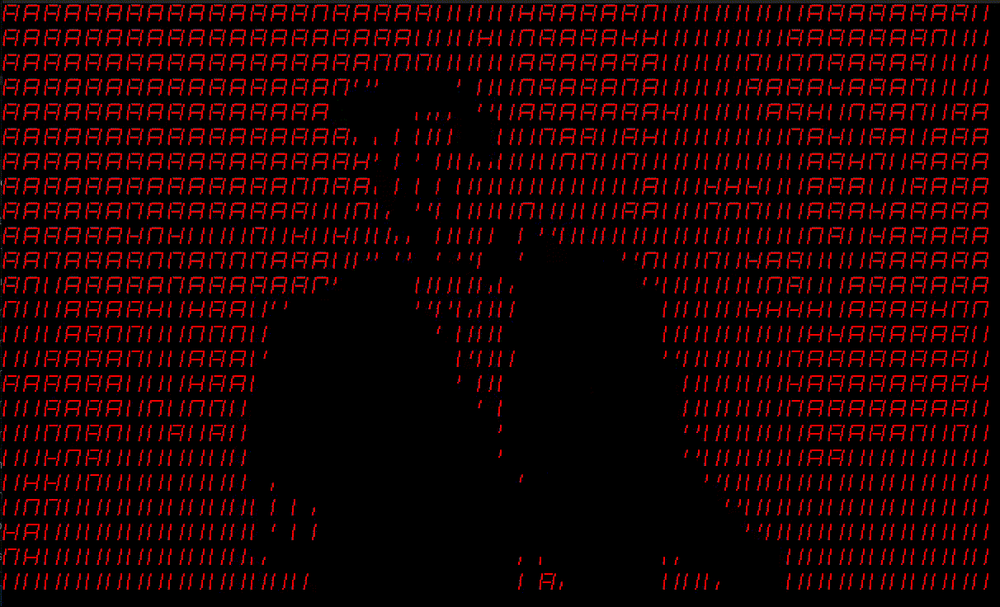
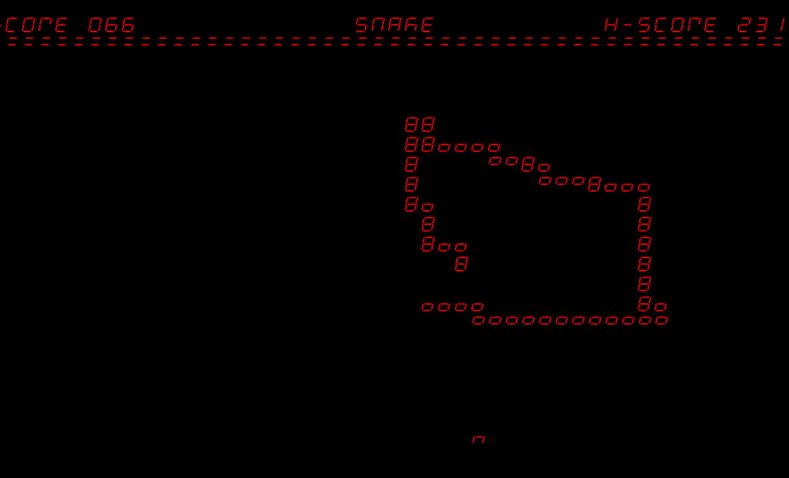
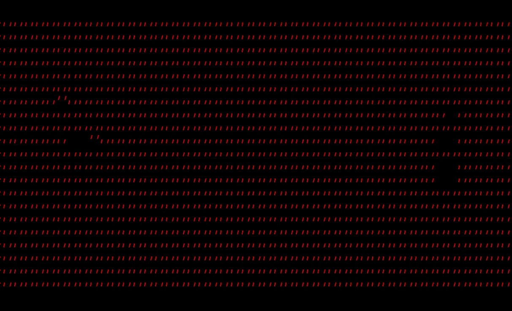

# Introduction

The Seven Segment Sign, or SSS for short, is a purely Python, Raspberry Pi-powered system that drives a screen of 1152 seven segment digits (arranged in a 48 x 24 array). But don't let these low specs fool you! This platform provides a beginner-friendly opportunity for anyone to learn how to address complex design problems with strict limitations. Some of the initial demos we've been able to make work are:

### Video Player

### Arcade Games

### and even Doom!

## What next?
 Even though the physical SSS resides in the [BYU NET Lab](https://netlab.byu.edu), the source code, blueprints, and a simulator are all available on [GitHub](https://www.github.com/NET-BYU/sss) and this wiki! 
 
 Take a look at the following links to help you get started:

 - [Get started](Get%20started.md)
 - [Support](../Troubleshooting/Support.md)

Happy hacking!
